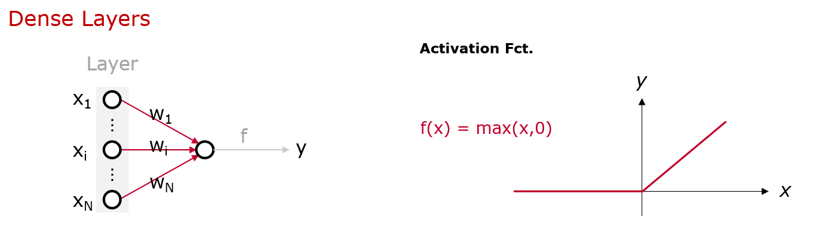

# Transfer Learning

>__Abstract__  
This article covers state of the art __deep learning__ neural networks for __image classification__ covering __convolutional neural networks__ and the idea of __transfer learning__.

## Image Classification
A state of the art approach of image classification is using __convolutional neural networks__. The architecture of those networks and the idea behind the different kinds of layers will be described below in more details.

### Architecture

### Functionality 
Each of the presented layers of the convolutional network has its own task to handle. On the left side there is simply the __input layer__, which contains the data in specific __tensor layout__.

The main part of the network can be found in the middle of the figure. As the name allready suggests there are several __convolutional layers__, which lead to the final __features layers__.

As seen above in the formula of a convolutional layer, depending on the weights w of the layer this can act like an edge filter, smoothing filter or shape filter and by that __find features__.

In the last fully connected dense layers the classification itself takes place. With all the presented or missing features of the previous layers a decission can be made __how to classify__.

### Challenges
Since for the classification it's essential to find all relevant features in the image, but as there might be only small data set provided to train this gets a hard task and leads to the next section about transfer learning.

## Transfer Learning
As allready mentioned the classification accuray depends strongly on the ability of finding all characteristic features in an image. But thankfully there is method called transfer learning which fills the gap.

There are allready trained networks on KERAS like ResNet-50, Inception or VGG-19 which are optimized on an enormously large data set, the so called ImageNet with many different classes.

Using the first layers and their __weights__ of such pre-trained networks for feature generation is called transfer learning and is a very helpful tool for the challenging image classification tasks.

As seen above the weights of those layers are freezed. Appending those frozen parts with dense layers makes it much easier to classifiy images, since the features are allready well generated.

### GitHub Repository
If you interested how to implement __transfer learning__ with Keras and Tensorflow in Python have a look on  my [Repository](https://github.com/Infoteam-DataScience/TransferLearning) on GitHub - there you can find a project on how to classify doog breeds.

