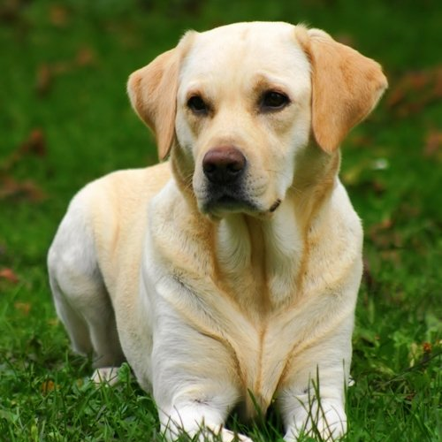
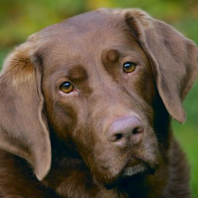
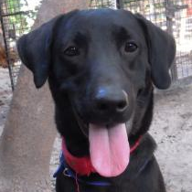
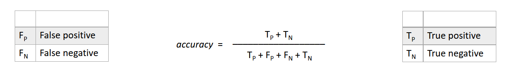

# Transfer Learning

> __Summary__  
This project is covering __transfer learning__ for neural networks in the context of image __classification__.

## Table of Contents

1. Project Structure  
    1.1. Files and Folders  
    1.2. All Requirements

2. Short Introduction  
    2.1. Main Motivation   
    2.2. Deeper Insights   

3. First naive Approach   
    3.1. The Architecture  
    3.2. Implementation

4. Transfer Learning  
    4.1. Application  
    4.2. Parameters  

5. Summary / Results  
    5.1. Metric Evaluation  
    5.2. Confusion Matrix

5. Short Conclusion

---

## 1. Project Structure

### 1.1. Files and Folders
- `Files`:  
    The main method is provided in the classify.py python file.

- `Folders`:  
    There is a _transfer_ folder contained the transferred network.

### 1.2. All Requirements
Since the project uses `Keras` with `TensorFlow` as backend it is strongly recommended to use __Nvidia GPUs__. All of the provided neural networks are highly computationally intensive and would therefore run a long time on the CPU.

>__Remark__  
There is also a __requirement.txt__ file provided in the repository with all the necessary python packages.

## 2. Short Introduction

### 2.1. Main Motivation
With the use of dog breed classification by neural networks the idea of convolutional networks and transfer learning are presented within this repository. Since there are a lot different dog breeds this is a challenging task with great insights of artificial intelligence applications.

### 2.2. Deeper Insights
The data base contains about __XYZ__ dog images and their dog breeds - in total there are __133__ different dog breeds provided. The task for the neural network is to classify the dog breed receiving only a dog image. 

>__Remark__  
The provided data set in the [link](https://s3-us-west-1.amazonaws.com/udacity-aind/dog-project/dogImages.zip) is already splitted into a training, testing and validation set folder. 

#### Distribution
In order to receive a better understanding of the classification task, let's have a look on the data distribution. As you can see in the figure below there are some dog breeds with just a few images provided for them.

#### Challanges 
But not only the data distribution, the __classification task__ itself will be a hard challenge as well. If we have a closer look into the data set there a same breeds with different colors or even some breed mixes contained.

 
 


>__Remark__  
In the three pictures above you can see a yellow, chocolate and black version of labrador for instance.

## 3. First naive Approach

### 3.1. The Architecture
A state of the art approach for image classification is using convolutional neural networks. The architecture can be seen below and the idea behind all layers will be described in my [blog post](https://philipp-killermann.medium.com/transfer-learning-6537a705bdaf) in more details.


### 3.2. Implementation
``` python
# creating a new model
model = Sequential()

# 1. convolution layer
model.add(Conv2D(64, (2, 2), activation='relu'))
model.add(MaxPooling2D((2, 2)))

# 2. convolution layer
model.add(Conv2D(32, (2, 2), activation='relu'))
model.add(MaxPooling2D((2, 2)))

# 3. convolution layer
model.add(Conv2D(16, (2, 2), activation='relu'))
model.add(MaxPooling2D((2, 2)))

# global averaged pool
model.add(GlobalAveragePooling2D())

# 1. dense full layers
model.add(Dense(512, activation='relu'))
model.add(Dropout(0.250)) 

# 2. dense full layers
model.add(Dense(256, activation='relu'))
model.add(Dropout(0.125)) 

# classification nodes
model.add(Dense(133, activation='softmax'))
```

>__Remark__  
The max pooling and drop-out layers of the naive network are included for additional regularization.

## 4. Transfer Learning

### 4.1. Application

The usage of the console application is quite simple by providing an image file path as the only argument.
```
python classify.py <image-filename>
```
In the initial run of the classification there no trained weights provided yet. In order to pre-train a network please download the dog breed dataset from this [Link](https://s3-us-west-1.amazonaws.com/udacity-aind/dog-project/dogImages.zip) and move the content to the folder `./dataset/`.

Once the training phase is finished there is a trained network provided in the file system and the command above will simply evaluate the network and no longer train it again.

>__Remark__  
This can also be done for human images - so feel free to discover if you look like a specific dog breed.

### 4.2. Parameters

As described in more details on my [blog post](https://philipp-killermann.medium.com/transfer-learning-6537a705bdaf) the classification accuracy depends strongly on the ability of finding all characteristic features in an image. 

Since this might be a challenging task due to small data sets or large hyper parameters search spaces, there is a method called transfer learning which fills the gap.


By that the first layers of the network are already defined with the ResNet architecture, there are only dense layers to be added for classification in the context. 

The last dense layer of the neural network contains of 133 nodes for the dog breed classification task, which corresponds to the total number of dog breeds.


## 5. Summary / Results  
### 5.1. Metric Evaluation  
In the last section, let's have a look on the different kinds of __metrices__ used during the classification task as seen in the screenshow below and describe them shortly.

TODO

#### Accuracy
In general the _accuracy_ is defined as the proportion of the as true predicted results (sum of true positive and true negative) among the number of all predicted results.



>__Remark__  
Since the data set is not well balanced (as seen above) the __confusion matrix__ will give more details about the performance of each class in the predictions.

#### Entropies
The loss function is described by the _categorical cross entropy_, as seen below where _y_ is the predicted result, _p_ the corresponding propability and N the total number of predictions.


>__Remark__  
The _log_ loss term of the forumla above takes into account the uncertainty of a prediction based on how much it varies from the actual reference label value.

After a training phase of 10 epochs the pre-trained network predicts __82.2%__ of the unknown validation set right, whereas the naive approach only predicts __XY.Z%__ correct.

|                   | Accuracy      |
| ----------------- |---------------|
| Naive Approach    | XY.Z%         | 
| Transfer Learning | 82.2%         | 

### 5.2. Confusion Matrix

## 6. Short Conclusion
The transfer learning technique surpasses the naive approach by far! This is a great and easy way to improve the accuracy of the dog breed image classification neural network.

Although the accuracy of this network is already quite high, one issue is still the performance of some classes due to the inbalanced data set as seen in the sections above.

>__Remark__  
This can only be tackled by a more __balanced__ training set or further techniques like _class weighting_.

Nevertheless - as a short outlook - the last part of the pre-trained network can still be improved by different kinds of __architectures__ or a __hyper parameter__ search for better configurations.

# Acknowledgement
I would like to thank Udacity for providing such a great idea and content for this data science project.
