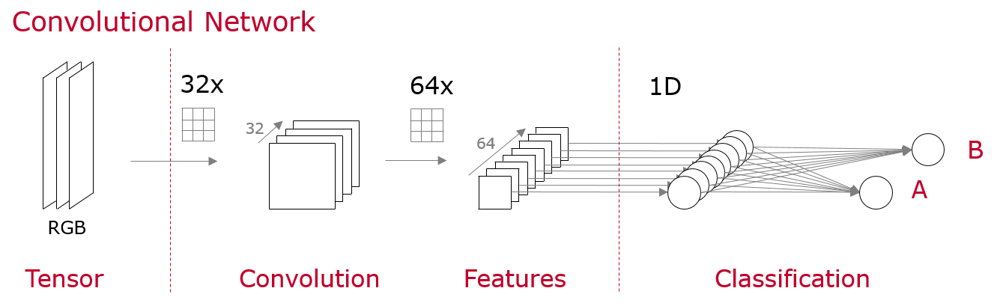
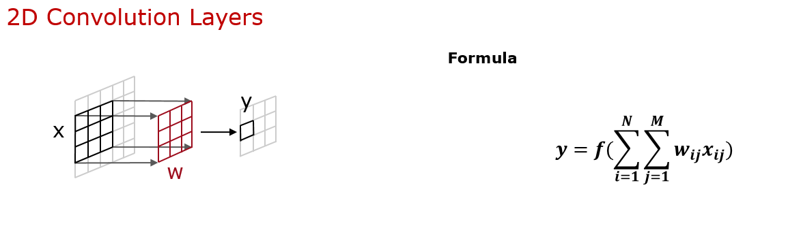
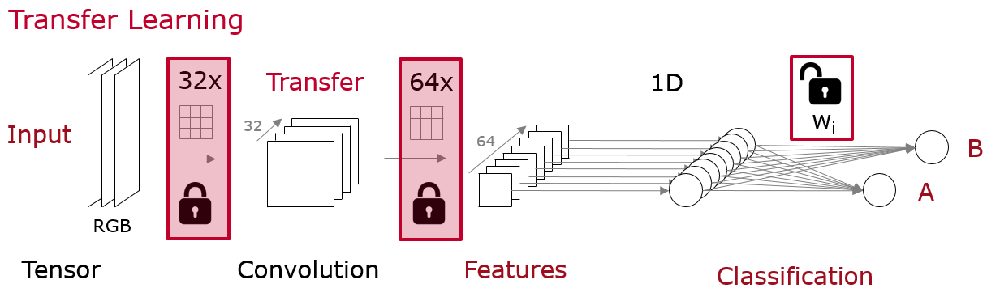

# Transfer Learning

> __Summary__  
This project covers state of the art __deep learning__ neural networks for image __classification__ covering __convolutional neural networks__ and the idea of __transfer learning__.

## Table of Contents

1. Project Structure  
    1.1. Main Motivation  
    1.2. Files and Folders
2. Requirements
3. Console Apps
4. Convolutional Neural Networks  
    4.1. Architecture  
    4.2. Functionality  
    4.3. Challenges
5. Transfer Learning - Application

---

## 1. Project Structure

### 1.1. Main Motivation
With the use of dog breed classification by neural networks the idea of convolutional networks and transfer learning are presented within this repository. Since there are a lot different dog breeds this is a challenging task with great insights of artificial intelligence applications.

### 1.2. Files and Folders
- `Files`:  
    The main method is provided in the classify.py python file.

- `Folders`:  
    There is a transfer folder contained the pre-trained network.

## 2. Requirements
Since the project uses `Keras` with `TensorFlow` as backend it is strongly recommended to use __Nvidia GPUs__. All of the provided neural networks are highly computational intensive and would therefore run a long time on the CPU.

## 3. Console Apps
The usage of the console application is quite simple by providing an image filepath as the only argument.
```
python classify.py <image-filename>
```

>__Remark__  
This can also be done for human images - so feel free to discover if you look like a specific dog breed.

## 4. Convolutional Neural Networks
A state of the art approach of image classification is using convolutional neural networks. The architecture of those networks and the idea behind the different kinds of layers will be described below.

### 4.1. Architecture


### 4.2. Functionality 
Each of the presented layers of the convolutional network has its own task to handle. On the left side there is simply the input layer, which contains the data in specific tensor layout.

The main part of the network can be found in the middle of the figure. As the name allready suggests there are several convolutional layers, which lead to the final features layers.



As seen above in the formula of a convolutional layer, depending on the weights w of the layer this can act like an edge filter, smoothing filter or shape filter and by that find features.


In the last fully connected dense layers the classification itself takes place. With all the presented or even missing features of the previous layers a decission can be formed there.

### 4.3. Challenges
Since for the classification it's crucial to find all relevant features in the image. But as there might be for example just a little data set to train this easily get a hard challenge and leads to the next section about transfer learning.

## 5. Transfer Learning - Applications
As allready mentioned the classification accuray depends strongly on the ability of finding all characteristic features in an image. But thankfully there is method called transfer learning which fills the gap.

There are allready trained networks on KERAS like ResNet-50, Inception or VGG-19 which are optimized on an enormously large data set, the so called ImageNet with many different classes.



Using the first layers and their weights of such pre-trained networks for feature generation is called transfer learning and is a very helpful tool for challenging image classification tasks.

As seend above the weights of those layers are freezed. Appending those frozen parts with dense layers makes it much easier to classifiy images, since the features are allready well generated.

# Acknowledgement
I would like to thank Udacity for providing such a great idea and content for this data science project.
