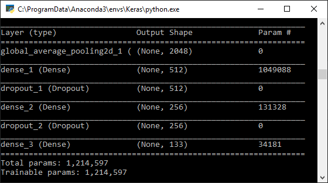
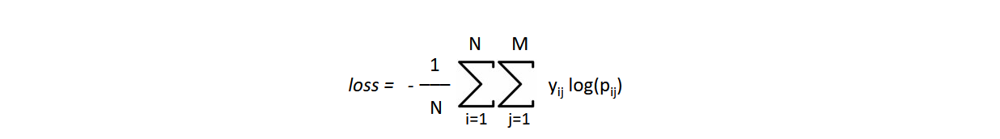

# Transfer Learning

> __Summary__  
This project is covering __transfer learning__ for neural networks in the context of image __classification__.

## Table of Contents

1. Project Structure  
    1.1. Main Motivation  
    1.2. Files and Folders  
    1.2. All Requirements
2. Transfer Learning  
    2.1. Application  
    2.2. Parameters  
    2.3. Metrices

---

## 1. Project Structure

### 1.1. Main Motivation
With the use of dog breed classification by neural networks the idea of convolutional networks and transfer learning are presented within this repository. Since there are a lot different dog breeds this is a challenging task with great insights of artificial intelligence applications.

### 1.2. Files and Folders
- `Files`:  
    The main method is provided in the classify.py python file.

- `Folders`:  
    There is a _transfer_ folder contained the transferred network.

### 1.2. All Requirements
Since the project uses `Keras` with `TensorFlow` as backend it is strongly recommended to use __Nvidia GPUs__. All of the provided neural networks are highly computationally intensive and would therefore run a long time on the CPU.

>__Remark__  
There is also a requirement.txt file provided in the repository with all the necessary packages.

## 2. Transfer Learning

### 2.1. Application

The usage of the console application is quite simple by providing an image file path as the only argument.
```
python classify.py <image-filename>
```
In the initial run of the classification there no trained weights provided yet. In order to pre-train a network please download the dog breed dataset from this [Link](https://s3-us-west-1.amazonaws.com/udacity-aind/dog-project/dogImages.zip) and move the content to the folder `./dataset/`.

Once the training phase is finished there is a trained network provided in the file system and the command above will simply evaluate the network and no longer train it again.

>__Remark__  
This can also be done for human images - so feel free to discover if you look like a specific dog breed.

### 2.2. Parameters

As described in more details on my [blog post](https://philipp-killermann.medium.com/transfer-learning-6537a705bdaf) the classification accuracy depends strongly on the ability of finding all characteristic features in an image. 

Since this might be a challenging task due to small data sets or large hyper parameters search spaces, there is a method called transfer learning which fills the gap.


By that the first layers of the network are already defined with the ResNet architecture, there are only dense layers to be added for classification in the context. 

The last dense layer of the neural network contains of 133 nodes for the dog breed classification task, which corresponds to the total number of dog breeds.



>__Remark__  
As an additional regularization step there are also some dropout layers included to the network too.

### 2.3. Metrices
In the last section, let's have a look on the __accuracy__ of the pre-trained  network. After a training phase of 10 epochs the neural network predicts __82.2%__ of the unknown validation set right.

>__Remark__  
During the training the loss function is described by the categorical cross entropy, as seen below where y<sub>P</sub> is the predicted result, y<sub>R</sub> the reference and N the total number of predictions.



# Acknowledgement
I would like to thank Udacity for providing such a great idea and content for this data science project.
